# ⚽ Football Winning Chances  

Automatically scrapes football league data and generates **Winning Chance (%)** graphs.  

## 📄 JSON API  

Access the raw data here:  
[winning_chances.json](https://raw.githubusercontent.com/akshdeepsingh7/football-stats/refs/heads/main/winning_chances.json)

## 📊 Winning Chances  

<!-- START_WINNING_CHANCES -->
**Last Updated:** Saturday, 07 February 2026, 02:21 PM UTC (Saturday, 07 February 2026, 07:51 PM IST)

_Charts are sorted by Winning Chance (%)_

### Premier League

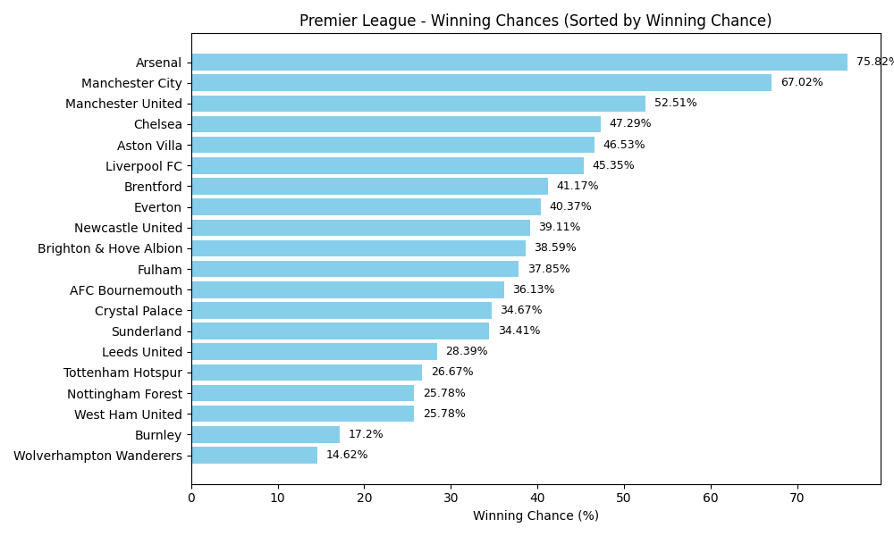

### La Liga

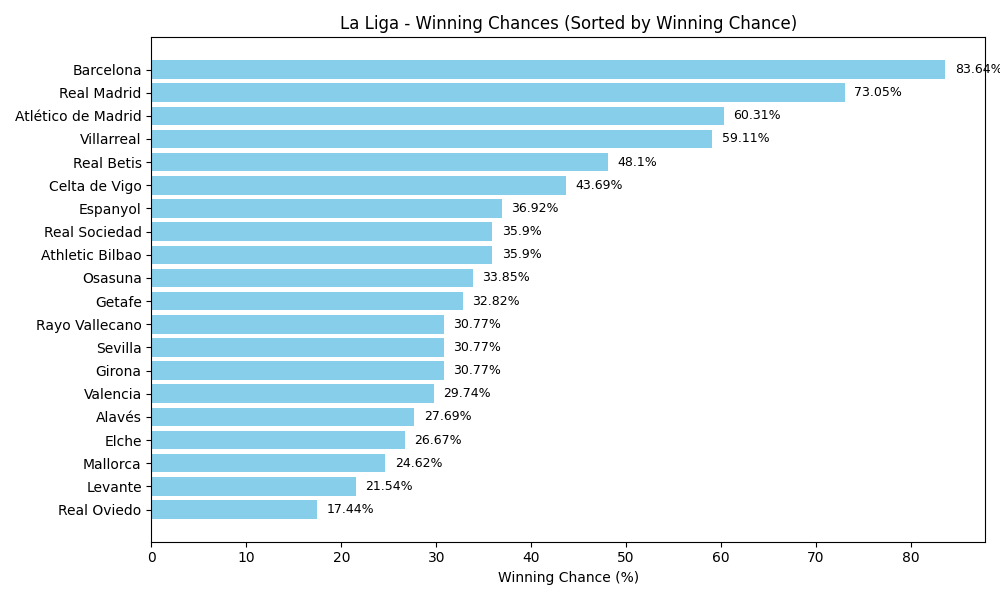

### Bundesliga

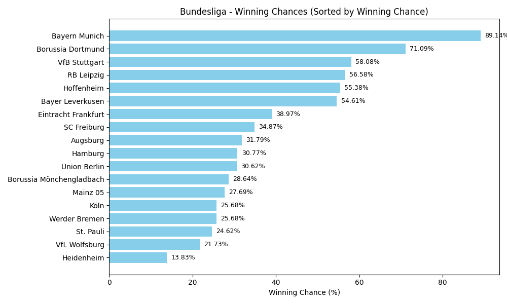

### Serie A

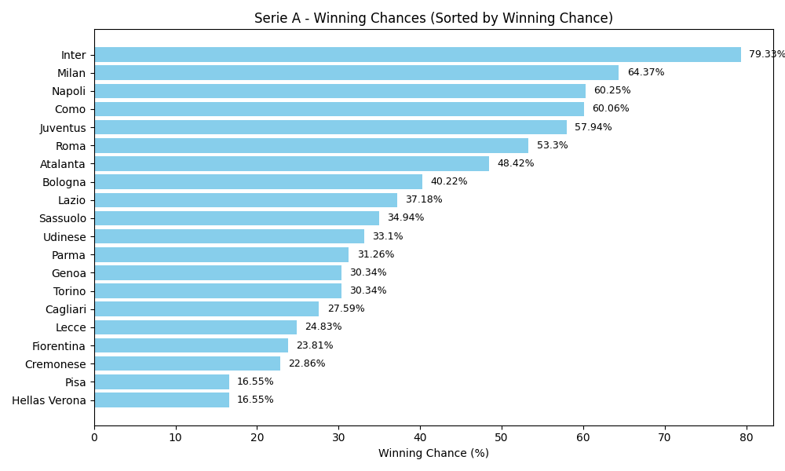

### Ligue 1

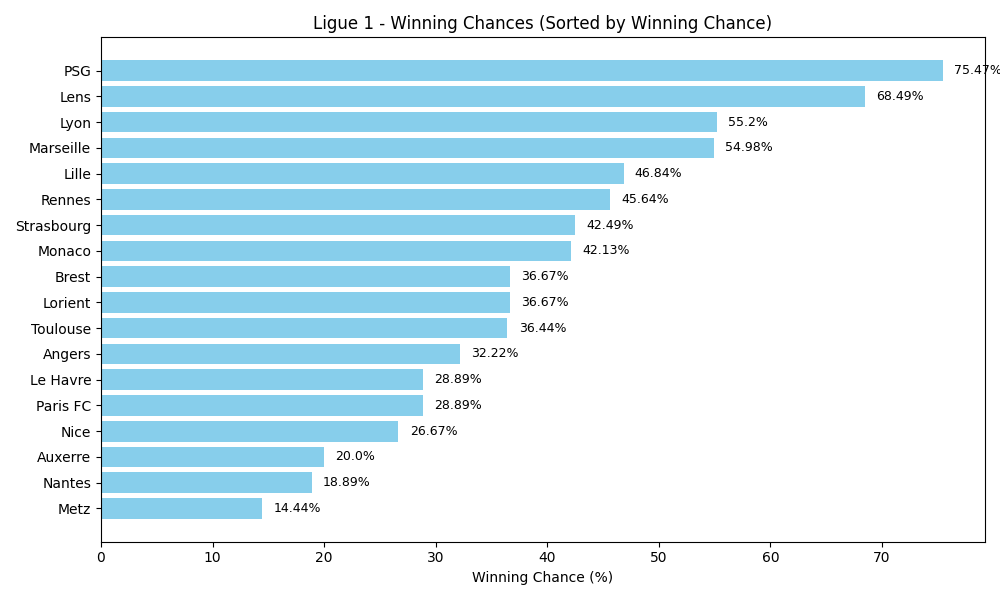

### Champions League

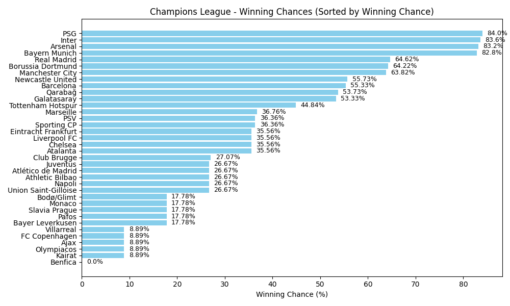

### Europa League

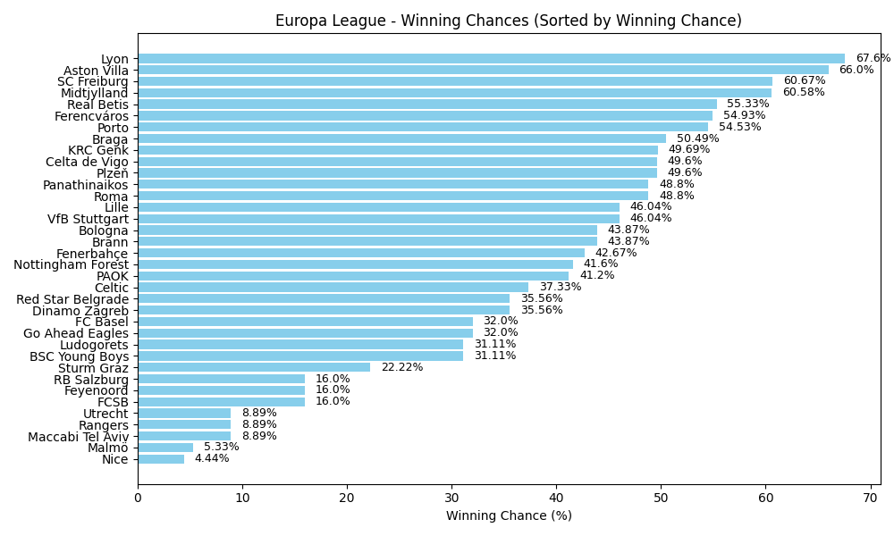

### Europa Conference League

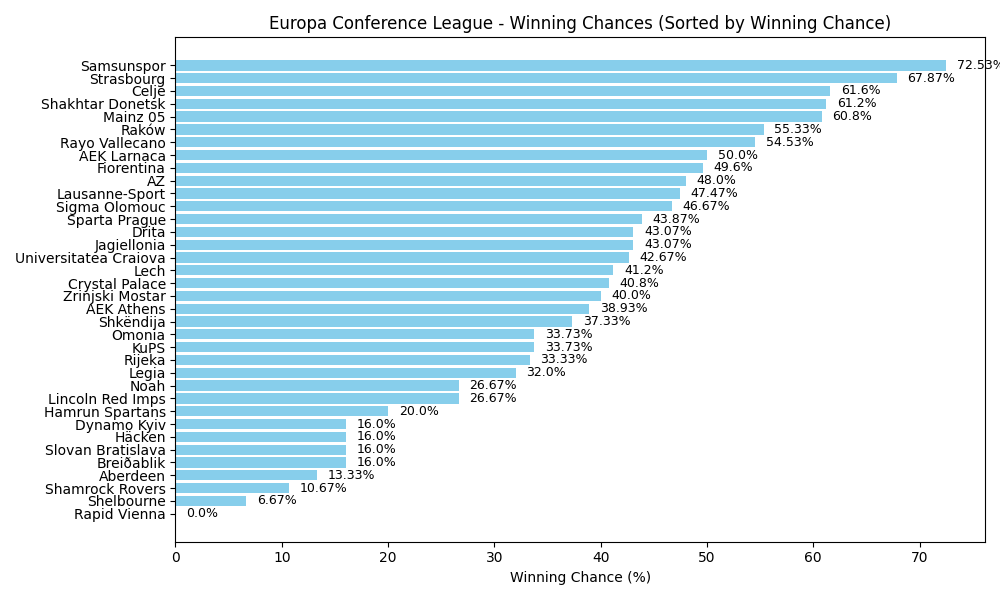

### Liga Portugal

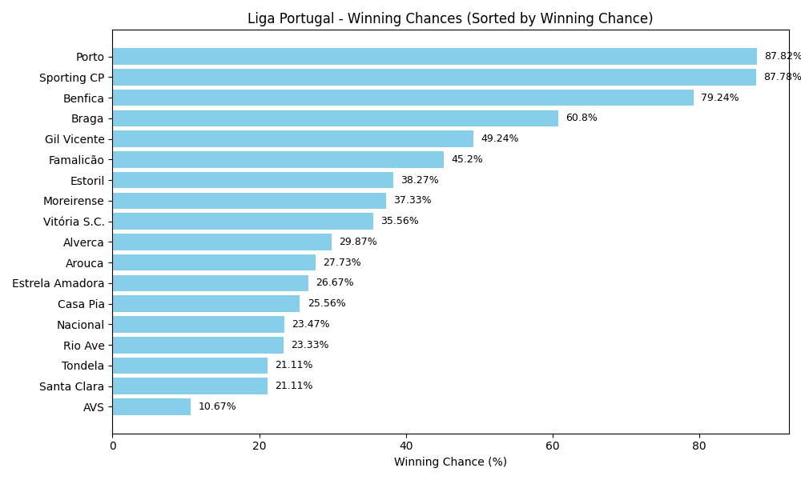

### EFL Championship

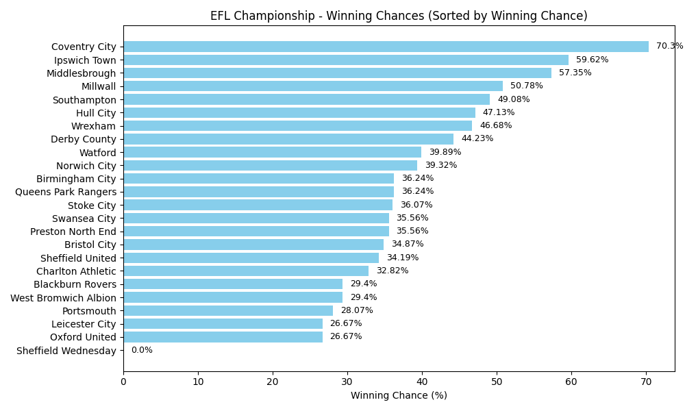

### Indian Super League

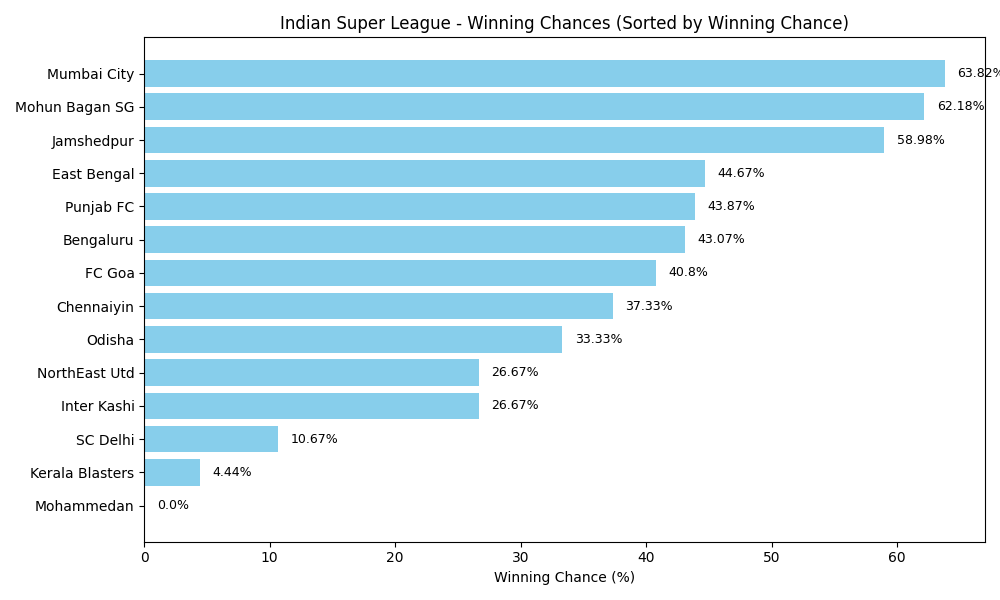

### Brasileirão

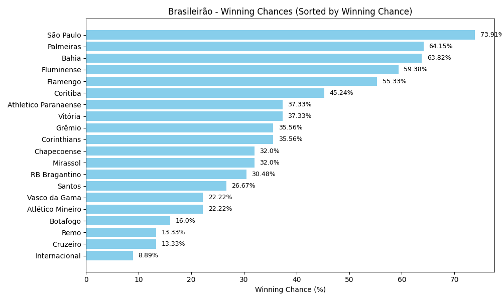

<!-- END_WINNING_CHANCES -->
