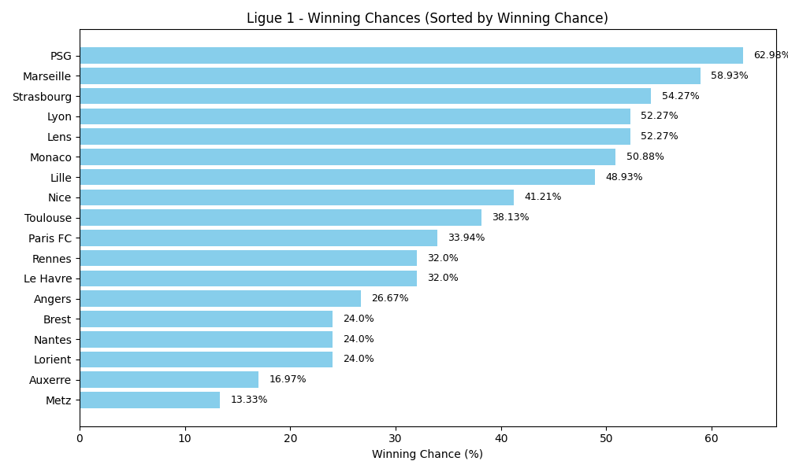
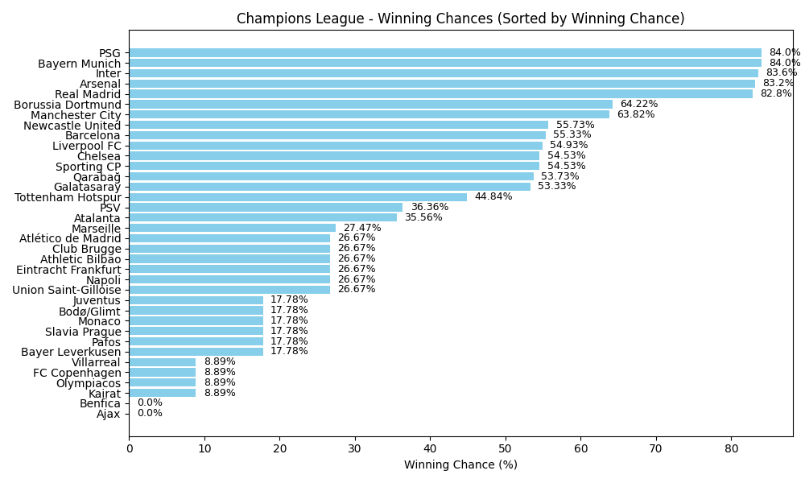

# ⚽ Football Winning Chances  

Automatically scrapes football league data and generates **Winning Chance (%)** graphs.  

## 📄 JSON API  

Access the raw data here:  
[winning_chances.json](https://raw.githubusercontent.com/akshdeepsingh7/football-stats/refs/heads/main/winning_chances.json)

## 📊 Winning Chances  

<!-- START_WINNING_CHANCES -->
**Last Updated:** Sunday, 23 November 2025, 08:40 PM UTC (Monday, 24 November 2025, 02:10 AM IST)

_Charts are sorted by Winning Chance (%)_

### Serie A

### Ligue 1

### Champions League

### Indian Super League

### Brasileirão

<!-- END_WINNING_CHANCES -->
